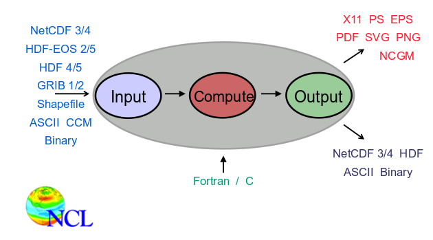
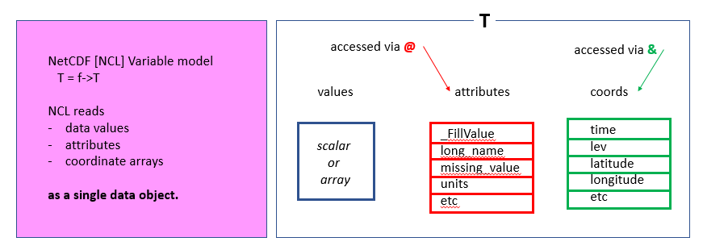

# What is NCL?

NCAR Command Language is an Integrated Processing Environment.
NCL syntax is close to python or matlab.

~~~
;================================================;
;  maponly_1.ncl
;================================================;
;
; Concepts illustrated:
;   - Drawing a default cylindrical equidistant map
;
;================================================;
;
; These files are loaded by default in NCL V6.2.0 and newer
; load "$NCARG_ROOT/lib/ncarg/nclscripts/csm/gsn_code.ncl"   
; load "$NCARG_ROOT/lib/ncarg/nclscripts/csm/gsn_csm.ncl"   
; ================================================;
begin

  wks  = gsn_open_wks("png","maponly")    ; send graphics to PNG file
  plot = gsn_csm_map(wks,False)        ; draw global map

  end
~~~

Ncl is an interpreted language (not compiled)

- Like python, R, matlab
- Unlike C, C++, fortran
- Many operations implemented in C/fortran under
the hood = fast performance
- Interpreter is invoked via the “ncl” command:

## How to run it?

~~~
$ ncl
~~~
{: .language.bash}

~~~
 Copyright (C) 1995-2015 - All Rights Reserved
 University Corporation for Atmospheric Research
 NCAR Command Language Version 6.3.0
 The use of this software is governed by a License Agreement.
 See http://www.ncl.ucar.edu/ for more details.
ncl 0>
~~~
{: .output}

### Pros

* Support netCDF-3/4, HDF-4/5, and GRIB-1/2
* Common data structure: NetCDF model
* Many useful & unique Application Functions
* Publication quality graphics out of the box
* Consistent documentation
* Many examples to get you started
* Excellent Support

### Cons

* Interactive environment is rather crude
* No debugger at user level

## What’s required to run it

* A Unix-like environment (on Windows, you would need cygwin)
* Some knowledge of bash shell commands (see http://swcarpentry.github.io/shell-novice/) to get a short introduction to bash shell)
* An editor (nano, atom, emacs, etc.)

### Running NCL interactively

Like for python or R, we can start ncl and enter ncl commands one after the other:

~~~
pi = 4.0 * atan(1.0)
print(pi)
~~~
{: .language-bash}

~~~
$ ncl
 Copyright (C) 1995-2015 - All Rights Reserved
 University Corporation for Atmospheric Research
 NCAR Command Language Version 6.3.0
 The use of this software is governed by a License Agreement.
 See http://www.ncl.ucar.edu/ for more details.
ncl 0> pi=4.0*atan(1.0)
ncl 1> print(pi)

Variable: pi
Type: float
Total Size: 4 bytes
            1 values
Number of Dimensions: 1
Dimensions and sizes:   [1]
Coordinates:
(0)     3.141593
ncl 2>
~~~
{: .output}

It is useful for testing your NCL installation but not recommended. We usually create a text file where we write our program and then execute it. 

For instance, let's create a new file called test.ncl with your favourite editor:

~~~
nano test.ncl
~~~
{: .language-bash}

Then store these two lines in test.ncl:

~~~
pi = 4.0 * atan(1.0)
print(pi)
~~~
{: .output}

Save your file. With nano, use CTRL (Control key on your keyboard) and x (key x) and enter (key Return on your keyboard).

To execute your ncl script:

~~~
ncl test.ncl
~~~
{: .language-bash}

~~~
 Copyright (C) 1995-2015 - All Rights Reserved
 University Corporation for Atmospheric Research
 NCAR Command Language Version 6.3.0
 The use of this software is governed by a License Agreement.
 See http://www.ncl.ucar.edu/ for more details.

Variable: pi
Type: float
Total Size: 4 bytes
            1 values
Number of Dimensions: 1
Dimensions and sizes:   [1]
Coordinates:
(0)     3.141593
~~~
{: .output}

Your ncl script may take a few seconds or a few hours depending on its complexity and how much data you are processing. It is therefore recommended to start your NCL script in `background` so you can logout from your computer and still run your script:

~~~
nohup ncl test.ncl > log_ncl.txt &
~~~
{: .language-bash}

The output of your NCL script will then be stored in log_ncl.txt (you can use nano or any other editor to inspect its content).

## NCL command line structure

To get the list of available options, you can use:

~~~
ncl -h
~~~
{: .language-bash}

~~~
Usage: ncl -fhnopxQV <args> <file.ncl>
         -f: use new file structure and NetCDF4 features when possible
         -h: print this message and exit
         -n: don't enumerate values in print()
         -o: retain former behavior for certain backwards-incompatible changes
         -p: don't page output from the system() command
         -x: echo NCL commands
         -Q: turn off echo of NCL version and copyright info
         -V: print NCL version and exit
~~~
{: .output}

* Some options modify behavior
* Others print information and exit
* May be combined: 

~~~
ncl –np test.ncl
~~~
{: .language-bash}

# The NetCDF data model à NCL’s data model

## Why is this important?

* NCL’s variable model is based upon NetCDF’s variable model. 
* NCL makes GRIB, HDF, HDF-EOS look like NetCDF
* This consistent and uniform view of disparate file formats is a
very powerful feature!

## Implication of using NetCDF structured, binary file format

* Can’t view contents directly from command-line
* Use tools like ncdump

## NetCDF array-like data

*  Common in atmospheric science and other science and engineering disciplines that employ finite-element methods.
* Comprised of variables, dimensions, attributes

### A bit more on netCDF with ncdump

Using the online command `ncdump -h` allows to get metadata information on your netCDF file. Let's take a history file of CESM CAM model:

~~~
ncdump -h
~~~
{: .language-bash}

~~~
netcdf f2000.T31T31.control.cam.h0.0007-08-29-00000 {
dimensions:
	lat = 48 ;
	lon = 96 ;
	time = UNLIMITED ; // (30 currently)
	nbnd = 2 ;
	chars = 8 ;
	lev = 30 ;
	ilev = 31 ;
variables:
	double lev(lev) ;
		lev:long_name = "hybrid level at midpoints (1000*(A+B))" ;
		lev:units = "level" ;
		lev:positive = "down" ;
		lev:standard_name = "atmosphere_hybrid_sigma_pressure_coordinate" ;
		lev:formula_terms = "a: hyam b: hybm p0: P0 ps: PS" ;
	double hyam(lev) ;
		hyam:long_name = "hybrid A coefficient at layer midpoints" ;
	double hybm(lev) ;
		hybm:long_name = "hybrid B coefficient at layer midpoints" ;
	double ilev(ilev) ;
		ilev:long_name = "hybrid level at interfaces (1000*(A+B))" ;
		ilev:units = "level" ;
		ilev:positive = "down" ;
		ilev:standard_name = "atmosphere_hybrid_sigma_pressure_coordinate" ;
		ilev:formula_terms = "a: hyai b: hybi p0: P0 ps: PS" ;
	double hyai(ilev) ;
		hyai:long_name = "hybrid A coefficient at layer interfaces" ;
	double hybi(ilev) ;
		hybi:long_name = "hybrid B coefficient at layer interfaces" ;
	double P0 ;
		P0:long_name = "reference pressure" ;
		P0:units = "Pa" ;
	double time(time) ;
		time:long_name = "time" ;
		time:units = "days since 0001-01-01 00:00:00" ;
		time:calendar = "noleap" ;
		time:bounds = "time_bnds" ;
	int date(time) ;
		date:long_name = "current date (YYYYMMDD)" ;
	int datesec(time) ;
		datesec:long_name = "current seconds of current date" ;
	double lat(lat) ;
		lat:long_name = "latitude" ;
		lat:units = "degrees_north" ;
	double lon(lon) ;
		lon:long_name = "longitude" ;
		lon:units = "degrees_east" ;
	double time_bnds(time, nbnd) ;
		time_bnds:long_name = "time interval endpoints" ;
	char date_written(time, chars) ;
	char time_written(time, chars) ;
	int ntrm ;
		ntrm:long_name = "spectral truncation parameter M" ;
	int ntrn ;
		ntrn:long_name = "spectral truncation parameter N" ;
	int ntrk ;
		ntrk:long_name = "spectral truncation parameter K" ;
	int ndbase ;
		ndbase:long_name = "base day" ;
	int nsbase ;
		nsbase:long_name = "seconds of base day" ;
	int nbdate ;
		nbdate:long_name = "base date (YYYYMMDD)" ;
	int nbsec ;
		nbsec:long_name = "seconds of base date" ;
	int mdt ;
		mdt:long_name = "timestep" ;
		mdt:units = "s" ;
	int nlon(lat) ;
		nlon:long_name = "number of longitudes" ;
	int wnummax(lat) ;
		wnummax:long_name = "cutoff Fourier wavenumber" ;
	double gw(lat) ;
		gw:long_name = "gauss weights" ;
	int ndcur(time) ;
		ndcur:long_name = "current day (from base day)" ;
	int nscur(time) ;
		nscur:long_name = "current seconds of current day" ;
	double co2vmr(time) ;
		co2vmr:long_name = "co2 volume mixing ratio" ;
	double ch4vmr(time) ;
		ch4vmr:long_name = "ch4 volume mixing ratio" ;
	double n2ovmr(time) ;
		n2ovmr:long_name = "n2o volume mixing ratio" ;
	double f11vmr(time) ;
		f11vmr:long_name = "f11 volume mixing ratio" ;
	double f12vmr(time) ;
		f12vmr:long_name = "f12 volume mixing ratio" ;
	double sol_tsi(time) ;
		sol_tsi:long_name = "total solar irradiance" ;
		sol_tsi:units = "W/m2" ;
	int nsteph(time) ;
		nsteph:long_name = "current timestep" ;
	float AEROD_v(time, lat, lon) ;
		AEROD_v:_FillValue = 1.e+36f ;
		AEROD_v:missing_value = 1.e+36f ;
		AEROD_v:units = "1" ;
		AEROD_v:long_name = "Total Aerosol Optical Depth in visible band" ;
		AEROD_v:cell_methods = "time: mean" ;
	float ANRAIN(time, lev, lat, lon) ;
		ANRAIN:mdims = 1 ;
		ANRAIN:units = "m-3" ;
		ANRAIN:long_name = "Average rain number conc" ;
		ANRAIN:cell_methods = "time: mean" ;
	float ANSNOW(time, lev, lat, lon) ;
		ANSNOW:mdims = 1 ;
		ANSNOW:units = "m-3" ;
		ANSNOW:long_name = "Average snow number conc" ;
		ANSNOW:cell_methods = "time: mean" ;
	float AODDUST1(time, lat, lon) ;
		AODDUST1:_FillValue = 1.e+36f ;
		AODDUST1:missing_value = 1.e+36f ;
		AODDUST1:units = "" ;
		AODDUST1:long_name = "Aerosol optical depth 550 nm model 1 from dust" ;
		AODDUST1:cell_methods = "time: mean" ;
	float AODDUST3(time, lat, lon) ;
		AODDUST3:_FillValue = 1.e+36f ;
		AODDUST3:missing_value = 1.e+36f ;
		AODDUST3:units = "" ;
		AODDUST3:long_name = "Aerosol optical depth 550 nm model 3 from dust" ;
		AODDUST3:cell_methods = "time: mean" ;
	float AODVIS(time, lat, lon) ;
		AODVIS:_FillValue = 1.e+36f ;
		AODVIS:missing_value = 1.e+36f ;
		AODVIS:units = "" ;
		AODVIS:long_name = "Aerosol optical depth 550 nm" ;
		AODVIS:cell_methods = "time: mean" ;
	float AQRAIN(time, lev, lat, lon) ;
		AQRAIN:mdims = 1 ;
		AQRAIN:units = "kg/kg" ;
		AQRAIN:long_name = "Average rain mixing ratio" ;
		AQRAIN:cell_methods = "time: mean" ;
	float AQSNOW(time, lev, lat, lon) ;
		AQSNOW:mdims = 1 ;
		AQSNOW:units = "kg/kg" ;
		AQSNOW:long_name = "Average snow mixing ratio" ;
		AQSNOW:cell_methods = "time: mean" ;
	float AREI(time, lev, lat, lon) ;
		AREI:mdims = 1 ;
		AREI:units = "Micron" ;
		AREI:long_name = "Average ice effective radius" ;
		AREI:cell_methods = "time: mean" ;
	float AREL(time, lev, lat, lon) ;
		AREL:mdims = 1 ;
		AREL:units = "Micron" ;
		AREL:long_name = "Average droplet effective radius" ;
		AREL:cell_methods = "time: mean" ;
	float AWNC(time, lev, lat, lon) ;
		AWNC:mdims = 1 ;
		AWNC:units = "m-3" ;
		AWNC:long_name = "Average cloud water number conc" ;
		AWNC:cell_methods = "time: mean" ;
	float AWNI(time, lev, lat, lon) ;
		AWNI:mdims = 1 ;
		AWNI:units = "m-3" ;
		AWNI:long_name = "Average cloud ice number conc" ;
		AWNI:cell_methods = "time: mean" ;
	float BURDEN1(time, lat, lon) ;
		BURDEN1:_FillValue = 1.e+36f ;
		BURDEN1:missing_value = 1.e+36f ;
		BURDEN1:units = "kg/m2" ;
		BURDEN1:long_name = "Aerosol burden mode 1" ;
		BURDEN1:cell_methods = "time: mean" ;
	float BURDEN2(time, lat, lon) ;
		BURDEN2:_FillValue = 1.e+36f ;
		BURDEN2:missing_value = 1.e+36f ;
		BURDEN2:units = "kg/m2" ;
		BURDEN2:long_name = "Aerosol burden mode 2" ;
		BURDEN2:cell_methods = "time: mean" ;
	float BURDEN3(time, lat, lon) ;
		BURDEN3:_FillValue = 1.e+36f ;
		BURDEN3:missing_value = 1.e+36f ;
		BURDEN3:units = "kg/m2" ;
		BURDEN3:long_name = "Aerosol burden mode 3" ;
		BURDEN3:cell_methods = "time: mean" ;
	float BURDENBC(time, lat, lon) ;
		BURDENBC:_FillValue = 1.e+36f ;
		BURDENBC:missing_value = 1.e+36f ;
		BURDENBC:units = "kg/m2" ;
		BURDENBC:long_name = "Black carbon aerosol burden" ;
		BURDENBC:cell_methods = "time: mean" ;
	float BURDENDUST(time, lat, lon) ;
		BURDENDUST:_FillValue = 1.e+36f ;
		BURDENDUST:missing_value = 1.e+36f ;
		BURDENDUST:units = "kg/m2" ;
		BURDENDUST:long_name = "Dust aerosol burden" ;
		BURDENDUST:cell_methods = "time: mean" ;
	float BURDENPOM(time, lat, lon) ;
		BURDENPOM:_FillValue = 1.e+36f ;
		BURDENPOM:missing_value = 1.e+36f ;
		BURDENPOM:units = "kg/m2" ;
		BURDENPOM:long_name = "POM aerosol burden" ;
		BURDENPOM:cell_methods = "time: mean" ;
	float BURDENSEASALT(time, lat, lon) ;
		BURDENSEASALT:_FillValue = 1.e+36f ;
		BURDENSEASALT:missing_value = 1.e+36f ;
		BURDENSEASALT:units = "kg/m2" ;
		BURDENSEASALT:long_name = "Seasalt aerosol burden" ;
		BURDENSEASALT:cell_methods = "time: mean" ;
	float BURDENSO4(time, lat, lon) ;
		BURDENSO4:_FillValue = 1.e+36f ;
		BURDENSO4:missing_value = 1.e+36f ;
		BURDENSO4:units = "kg/m2" ;
		BURDENSO4:long_name = "Sulfate aerosol burden" ;
		BURDENSO4:cell_methods = "time: mean" ;
	float BURDENSOA(time, lat, lon) ;
		BURDENSOA:_FillValue = 1.e+36f ;
		BURDENSOA:missing_value = 1.e+36f ;
		BURDENSOA:units = "kg/m2" ;
		BURDENSOA:long_name = "SOA aerosol burden" ;
		BURDENSOA:cell_methods = "time: mean" ;
	float CCN3(time, lev, lat, lon) ;
		CCN3:mdims = 1 ;
		CCN3:units = "#/cm3" ;
		CCN3:long_name = "CCN concentration at S=0.1%" ;
		CCN3:cell_methods = "time: mean" ;
	float CDNUMC(time, lat, lon) ;
		CDNUMC:units = "1/m2" ;
		CDNUMC:long_name = "Vertically-integrated droplet concentration" ;
		CDNUMC:cell_methods = "time: mean" ;
	float CLDHGH(time, lat, lon) ;
		CLDHGH:units = "fraction" ;
		CLDHGH:long_name = "Vertically-integrated high cloud" ;
		CLDHGH:cell_methods = "time: mean" ;
	float CLDICE(time, lev, lat, lon) ;
		CLDICE:mdims = 1 ;
		CLDICE:units = "kg/kg" ;
		CLDICE:long_name = "Grid box averaged cloud ice amount" ;
		CLDICE:cell_methods = "time: mean" ;
	float CLDLIQ(time, lev, lat, lon) ;
		CLDLIQ:mdims = 1 ;
		CLDLIQ:units = "kg/kg" ;
		CLDLIQ:long_name = "Grid box averaged cloud liquid amount" ;
		CLDLIQ:cell_methods = "time: mean" ;
	float CLDLOW(time, lat, lon) ;
		CLDLOW:units = "fraction" ;
		CLDLOW:long_name = "Vertically-integrated low cloud" ;
		CLDLOW:cell_methods = "time: mean" ;
	float CLDMED(time, lat, lon) ;
		CLDMED:units = "fraction" ;
		CLDMED:long_name = "Vertically-integrated mid-level cloud" ;
		CLDMED:cell_methods = "time: mean" ;
	float CLDTOT(time, lat, lon) ;
		CLDTOT:units = "fraction" ;
		CLDTOT:long_name = "Vertically-integrated total cloud" ;
		CLDTOT:cell_methods = "time: mean" ;
	float CLOUD(time, lev, lat, lon) ;
		CLOUD:mdims = 1 ;
		CLOUD:units = "fraction" ;
		CLOUD:long_name = "Cloud fraction" ;
		CLOUD:cell_methods = "time: mean" ;
	float DCQ(time, lev, lat, lon) ;
		DCQ:mdims = 1 ;
		DCQ:units = "kg/kg/s" ;
		DCQ:long_name = "Q tendency due to moist processes" ;
		DCQ:cell_methods = "time: mean" ;
	float DMS_SRF(time, lat, lon) ;
		DMS_SRF:units = "kg/kg" ;
		DMS_SRF:long_name = "DMS in bottom layer" ;
		DMS_SRF:cell_methods = "time: mean" ;
	float DTCOND(time, lev, lat, lon) ;
		DTCOND:mdims = 1 ;
		DTCOND:units = "K/s" ;
		DTCOND:long_name = "T tendency - moist processes" ;
		DTCOND:cell_methods = "time: mean" ;
	float DTH(time, lev, lat, lon) ;
		DTH:mdims = 1 ;
		DTH:units = "K/s" ;
		DTH:long_name = "T horizontal diffusive heating" ;
		DTH:cell_methods = "time: mean" ;
	float DTV(time, lev, lat, lon) ;
		DTV:mdims = 1 ;
		DTV:units = "K/s" ;
		DTV:long_name = "T vertical diffusion" ;
		DTV:cell_methods = "time: mean" ;
	float EMISCLD(time, lev, lat, lon) ;
		EMISCLD:mdims = 1 ;
		EMISCLD:units = "1" ;
		EMISCLD:long_name = "cloud emissivity" ;
		EMISCLD:cell_methods = "time: mean" ;
	float FICE(time, lev, lat, lon) ;
		FICE:mdims = 1 ;
		FICE:units = "fraction" ;
		FICE:long_name = "Fractional ice content within cloud" ;
		FICE:cell_methods = "time: mean" ;
	float FLDS(time, lat, lon) ;
		FLDS:Sampling_Sequence = "rad_lwsw" ;
		FLDS:units = "W/m2" ;
		FLDS:long_name = "Downwelling longwave flux at surface" ;
		FLDS:cell_methods = "time: mean" ;
	float FLNS(time, lat, lon) ;
		FLNS:Sampling_Sequence = "rad_lwsw" ;
		FLNS:units = "W/m2" ;
		FLNS:long_name = "Net longwave flux at surface" ;
		FLNS:cell_methods = "time: mean" ;
	float FLNSC(time, lat, lon) ;
		FLNSC:Sampling_Sequence = "rad_lwsw" ;
		FLNSC:units = "W/m2" ;
		FLNSC:long_name = "Clearsky net longwave flux at surface" ;
		FLNSC:cell_methods = "time: mean" ;
	float FLNT(time, lat, lon) ;
		FLNT:Sampling_Sequence = "rad_lwsw" ;
		FLNT:units = "W/m2" ;
		FLNT:long_name = "Net longwave flux at top of model" ;
		FLNT:cell_methods = "time: mean" ;
	float FLNTC(time, lat, lon) ;
		FLNTC:Sampling_Sequence = "rad_lwsw" ;
		FLNTC:units = "W/m2" ;
		FLNTC:long_name = "Clearsky net longwave flux at top of model" ;
		FLNTC:cell_methods = "time: mean" ;
	float FLUT(time, lat, lon) ;
		FLUT:Sampling_Sequence = "rad_lwsw" ;
		FLUT:units = "W/m2" ;
		FLUT:long_name = "Upwelling longwave flux at top of model" ;
		FLUT:cell_methods = "time: mean" ;
	float FLUTC(time, lat, lon) ;
		FLUTC:Sampling_Sequence = "rad_lwsw" ;
		FLUTC:units = "W/m2" ;
		FLUTC:long_name = "Clearsky upwelling longwave flux at top of model" ;
		FLUTC:cell_methods = "time: mean" ;
	float FREQI(time, lev, lat, lon) ;
		FREQI:mdims = 1 ;
		FREQI:units = "fraction" ;
		FREQI:long_name = "Fractional occurrence of ice" ;
		FREQI:cell_methods = "time: mean" ;
	float FREQL(time, lev, lat, lon) ;
		FREQL:mdims = 1 ;
		FREQL:units = "fraction" ;
		FREQL:long_name = "Fractional occurrence of liquid" ;
		FREQL:cell_methods = "time: mean" ;
	float FREQR(time, lev, lat, lon) ;
		FREQR:mdims = 1 ;
		FREQR:units = "fraction" ;
		FREQR:long_name = "Fractional occurrence of rain" ;
		FREQR:cell_methods = "time: mean" ;
	float FREQS(time, lev, lat, lon) ;
		FREQS:mdims = 1 ;
		FREQS:units = "fraction" ;
		FREQS:long_name = "Fractional occurrence of snow" ;
		FREQS:cell_methods = "time: mean" ;
	float FSDS(time, lat, lon) ;
		FSDS:Sampling_Sequence = "rad_lwsw" ;
		FSDS:units = "W/m2" ;
		FSDS:long_name = "Downwelling solar flux at surface" ;
		FSDS:cell_methods = "time: mean" ;
	float FSDSC(time, lat, lon) ;
		FSDSC:Sampling_Sequence = "rad_lwsw" ;
		FSDSC:units = "W/m2" ;
		FSDSC:long_name = "Clearsky downwelling solar flux at surface" ;
		FSDSC:cell_methods = "time: mean" ;
	float FSNS(time, lat, lon) ;
		FSNS:Sampling_Sequence = "rad_lwsw" ;
		FSNS:units = "W/m2" ;
		FSNS:long_name = "Net solar flux at surface" ;
		FSNS:cell_methods = "time: mean" ;
	float FSNSC(time, lat, lon) ;
		FSNSC:Sampling_Sequence = "rad_lwsw" ;
		FSNSC:units = "W/m2" ;
		FSNSC:long_name = "Clearsky net solar flux at surface" ;
		FSNSC:cell_methods = "time: mean" ;
	float FSNT(time, lat, lon) ;
		FSNT:Sampling_Sequence = "rad_lwsw" ;
		FSNT:units = "W/m2" ;
		FSNT:long_name = "Net solar flux at top of model" ;
		FSNT:cell_methods = "time: mean" ;
	float FSNTC(time, lat, lon) ;
		FSNTC:Sampling_Sequence = "rad_lwsw" ;
		FSNTC:units = "W/m2" ;
		FSNTC:long_name = "Clearsky net solar flux at top of model" ;
		FSNTC:cell_methods = "time: mean" ;
	float FSNTOA(time, lat, lon) ;
		FSNTOA:Sampling_Sequence = "rad_lwsw" ;
		FSNTOA:units = "W/m2" ;
		FSNTOA:long_name = "Net solar flux at top of atmosphere" ;
		FSNTOA:cell_methods = "time: mean" ;
	float FSNTOAC(time, lat, lon) ;
		FSNTOAC:Sampling_Sequence = "rad_lwsw" ;
		FSNTOAC:units = "W/m2" ;
		FSNTOAC:long_name = "Clearsky net solar flux at top of atmosphere" ;
		FSNTOAC:cell_methods = "time: mean" ;
	float FSUTOA(time, lat, lon) ;
		FSUTOA:Sampling_Sequence = "rad_lwsw" ;
		FSUTOA:units = "W/m2" ;
		FSUTOA:long_name = "Upwelling solar flux at top of atmosphere" ;
		FSUTOA:cell_methods = "time: mean" ;
	float H2O2_SRF(time, lat, lon) ;
		H2O2_SRF:units = "kg/kg" ;
		H2O2_SRF:long_name = "H2O2 in bottom layer" ;
		H2O2_SRF:cell_methods = "time: mean" ;
	float H2SO4_SRF(time, lat, lon) ;
		H2SO4_SRF:units = "kg/kg" ;
		H2SO4_SRF:long_name = "H2SO4 in bottom layer" ;
		H2SO4_SRF:cell_methods = "time: mean" ;
	float ICEFRAC(time, lat, lon) ;
		ICEFRAC:units = "fraction" ;
		ICEFRAC:long_name = "Fraction of sfc area covered by sea-ice" ;
		ICEFRAC:cell_methods = "time: mean" ;
	float ICIMR(time, lev, lat, lon) ;
		ICIMR:mdims = 1 ;
		ICIMR:units = "kg/kg" ;
		ICIMR:long_name = "Prognostic in-cloud ice mixing ratio" ;
		ICIMR:cell_methods = "time: mean" ;
	float ICWMR(time, lev, lat, lon) ;
		ICWMR:mdims = 1 ;
		ICWMR:units = "kg/kg" ;
		ICWMR:long_name = "Prognostic in-cloud water mixing ratio" ;
		ICWMR:cell_methods = "time: mean" ;
	float IWC(time, lev, lat, lon) ;
		IWC:mdims = 1 ;
		IWC:units = "kg/m3" ;
		IWC:long_name = "Grid box average ice water content" ;
		IWC:cell_methods = "time: mean" ;
	float LANDFRAC(time, lat, lon) ;
		LANDFRAC:units = "fraction" ;
		LANDFRAC:long_name = "Fraction of sfc area covered by land" ;
		LANDFRAC:cell_methods = "time: mean" ;
	float LHFLX(time, lat, lon) ;
		LHFLX:units = "W/m2" ;
		LHFLX:long_name = "Surface latent heat flux" ;
		LHFLX:cell_methods = "time: mean" ;
	float LWCF(time, lat, lon) ;
		LWCF:Sampling_Sequence = "rad_lwsw" ;
		LWCF:units = "W/m2" ;
		LWCF:long_name = "Longwave cloud forcing" ;
		LWCF:cell_methods = "time: mean" ;
	float NUMICE(time, lev, lat, lon) ;
		NUMICE:mdims = 1 ;
		NUMICE:units = "1/kg" ;
		NUMICE:long_name = "Grid box averaged cloud ice number" ;
		NUMICE:cell_methods = "time: mean" ;
	float NUMLIQ(time, lev, lat, lon) ;
		NUMLIQ:mdims = 1 ;
		NUMLIQ:units = "1/kg" ;
		NUMLIQ:long_name = "Grid box averaged cloud liquid number" ;
		NUMLIQ:cell_methods = "time: mean" ;
	float OCNFRAC(time, lat, lon) ;
		OCNFRAC:units = "fraction" ;
		OCNFRAC:long_name = "Fraction of sfc area covered by ocean" ;
		OCNFRAC:cell_methods = "time: mean" ;
	float OMEGA(time, lev, lat, lon) ;
		OMEGA:mdims = 1 ;
		OMEGA:units = "Pa/s" ;
		OMEGA:long_name = "Vertical velocity (pressure)" ;
		OMEGA:cell_methods = "time: mean" ;
	float OMEGAT(time, lev, lat, lon) ;
		OMEGAT:mdims = 1 ;
		OMEGAT:units = "K Pa/s" ;
		OMEGAT:long_name = "Vertical heat flux" ;
		OMEGAT:cell_methods = "time: mean" ;
	float ORO(time, lat, lon) ;
		ORO:units = "frac" ;
		ORO:long_name = "ORO" ;
		ORO:cell_methods = "time: mean" ;
	float PBLH(time, lat, lon) ;
		PBLH:units = "m" ;
		PBLH:long_name = "PBL height" ;
		PBLH:cell_methods = "time: mean" ;
	float PHIS(time, lat, lon) ;
		PHIS:units = "m2/s2" ;
		PHIS:long_name = "Surface geopotential" ;
	float PRECC(time, lat, lon) ;
		PRECC:units = "m/s" ;
		PRECC:long_name = "Convective precipitation rate (liq + ice)" ;
		PRECC:cell_methods = "time: mean" ;
	float PRECL(time, lat, lon) ;
		PRECL:units = "m/s" ;
		PRECL:long_name = "Large-scale (stable) precipitation rate (liq + ice)" ;
		PRECL:cell_methods = "time: mean" ;
	float PRECSC(time, lat, lon) ;
		PRECSC:units = "m/s" ;
		PRECSC:long_name = "Convective snow rate (water equivalent)" ;
		PRECSC:cell_methods = "time: mean" ;
	float PRECSL(time, lat, lon) ;
		PRECSL:units = "m/s" ;
		PRECSL:long_name = "Large-scale (stable) snow rate (water equivalent)" ;
		PRECSL:cell_methods = "time: mean" ;
	float PS(time, lat, lon) ;
		PS:units = "Pa" ;
		PS:long_name = "Surface pressure" ;
		PS:cell_methods = "time: mean" ;
	float PSL(time, lat, lon) ;
		PSL:units = "Pa" ;
		PSL:long_name = "Sea level pressure" ;
		PSL:cell_methods = "time: mean" ;
	float Q(time, lev, lat, lon) ;
		Q:mdims = 1 ;
		Q:units = "kg/kg" ;
		Q:long_name = "Specific humidity" ;
		Q:cell_methods = "time: mean" ;
	float QFLX(time, lat, lon) ;
		QFLX:units = "kg/m2/s" ;
		QFLX:long_name = "Surface water flux" ;
		QFLX:cell_methods = "time: mean" ;
	float QREFHT(time, lat, lon) ;
		QREFHT:units = "kg/kg" ;
		QREFHT:long_name = "Reference height humidity" ;
		QREFHT:cell_methods = "time: mean" ;
	float QRL(time, lev, lat, lon) ;
		QRL:mdims = 1 ;
		QRL:Sampling_Sequence = "rad_lwsw" ;
		QRL:units = "K/s" ;
		QRL:long_name = "Longwave heating rate" ;
		QRL:cell_methods = "time: mean" ;
	float QRS(time, lev, lat, lon) ;
		QRS:mdims = 1 ;
		QRS:Sampling_Sequence = "rad_lwsw" ;
		QRS:units = "K/s" ;
		QRS:long_name = "Solar heating rate" ;
		QRS:cell_methods = "time: mean" ;
	float RELHUM(time, lev, lat, lon) ;
		RELHUM:mdims = 1 ;
		RELHUM:units = "percent" ;
		RELHUM:long_name = "Relative humidity" ;
		RELHUM:cell_methods = "time: mean" ;
	float SHFLX(time, lat, lon) ;
		SHFLX:units = "W/m2" ;
		SHFLX:long_name = "Surface sensible heat flux" ;
		SHFLX:cell_methods = "time: mean" ;
	float SNOWHICE(time, lat, lon) ;
		SNOWHICE:units = "m" ;
		SNOWHICE:long_name = "Snow depth over ice" ;
		SNOWHICE:cell_methods = "time: mean" ;
	float SNOWHLND(time, lat, lon) ;
		SNOWHLND:units = "m" ;
		SNOWHLND:long_name = "Water equivalent snow depth" ;
		SNOWHLND:cell_methods = "time: mean" ;
	float SO2_SRF(time, lat, lon) ;
		SO2_SRF:units = "kg/kg" ;
		SO2_SRF:long_name = "SO2 in bottom layer" ;
		SO2_SRF:cell_methods = "time: mean" ;
	float SOAG_SRF(time, lat, lon) ;
		SOAG_SRF:units = "kg/kg" ;
		SOAG_SRF:long_name = "SOAG in bottom layer" ;
		SOAG_SRF:cell_methods = "time: mean" ;
	float SOLIN(time, lat, lon) ;
		SOLIN:Sampling_Sequence = "rad_lwsw" ;
		SOLIN:units = "W/m2" ;
		SOLIN:long_name = "Solar insolation" ;
		SOLIN:cell_methods = "time: mean" ;
	float SWCF(time, lat, lon) ;
		SWCF:Sampling_Sequence = "rad_lwsw" ;
		SWCF:units = "W/m2" ;
		SWCF:long_name = "Shortwave cloud forcing" ;
		SWCF:cell_methods = "time: mean" ;
	float T(time, lev, lat, lon) ;
		T:mdims = 1 ;
		T:units = "K" ;
		T:long_name = "Temperature" ;
		T:cell_methods = "time: mean" ;
	float TAUX(time, lat, lon) ;
		TAUX:units = "N/m2" ;
		TAUX:long_name = "Zonal surface stress" ;
		TAUX:cell_methods = "time: mean" ;
	float TAUY(time, lat, lon) ;
		TAUY:units = "N/m2" ;
		TAUY:long_name = "Meridional surface stress" ;
		TAUY:cell_methods = "time: mean" ;
	float TGCLDCWP(time, lat, lon) ;
		TGCLDCWP:units = "kg/m2" ;
		TGCLDCWP:long_name = "Total grid-box cloud water path (liquid and ice)" ;
		TGCLDCWP:cell_methods = "time: mean" ;
	float TGCLDIWP(time, lat, lon) ;
		TGCLDIWP:units = "kg/m2" ;
		TGCLDIWP:long_name = "Total grid-box cloud ice water path" ;
		TGCLDIWP:cell_methods = "time: mean" ;
	float TGCLDLWP(time, lat, lon) ;
		TGCLDLWP:units = "kg/m2" ;
		TGCLDLWP:long_name = "Total grid-box cloud liquid water path" ;
		TGCLDLWP:cell_methods = "time: mean" ;
	float TMQ(time, lat, lon) ;
		TMQ:units = "kg/m2" ;
		TMQ:long_name = "Total (vertically integrated) precipitable water" ;
		TMQ:cell_methods = "time: mean" ;
	float TREFHT(time, lat, lon) ;
		TREFHT:units = "K" ;
		TREFHT:long_name = "Reference height temperature" ;
		TREFHT:cell_methods = "time: mean" ;
	float TS(time, lat, lon) ;
		TS:units = "K" ;
		TS:long_name = "Surface temperature (radiative)" ;
		TS:cell_methods = "time: mean" ;
	float TSMN(time, lat, lon) ;
		TSMN:units = "K" ;
		TSMN:long_name = "Minimum surface temperature over output period" ;
		TSMN:cell_methods = "time: minimum" ;
	float TSMX(time, lat, lon) ;
		TSMX:units = "K" ;
		TSMX:long_name = "Maximum surface temperature over output period" ;
		TSMX:cell_methods = "time: maximum" ;
	float U(time, lev, lat, lon) ;
		U:mdims = 1 ;
		U:units = "m/s" ;
		U:long_name = "Zonal wind" ;
		U:cell_methods = "time: mean" ;
	float U10(time, lat, lon) ;
		U10:units = "m/s" ;
		U10:long_name = "10m wind speed" ;
		U10:cell_methods = "time: mean" ;
	float UU(time, lev, lat, lon) ;
		UU:mdims = 1 ;
		UU:units = "m2/s2" ;
		UU:long_name = "Zonal velocity squared" ;
		UU:cell_methods = "time: mean" ;
	float V(time, lev, lat, lon) ;
		V:mdims = 1 ;
		V:units = "m/s" ;
		V:long_name = "Meridional wind" ;
		V:cell_methods = "time: mean" ;
	float VD01(time, lev, lat, lon) ;
		VD01:mdims = 1 ;
		VD01:units = "kg/kg/s" ;
		VD01:long_name = "Vertical diffusion of Q" ;
		VD01:cell_methods = "time: mean" ;
	float VQ(time, lev, lat, lon) ;
		VQ:mdims = 1 ;
		VQ:units = "m/skg/kg" ;
		VQ:long_name = "Meridional water transport" ;
		VQ:cell_methods = "time: mean" ;
	float VT(time, lev, lat, lon) ;
		VT:mdims = 1 ;
		VT:units = "K m/s" ;
		VT:long_name = "Meridional heat transport" ;
		VT:cell_methods = "time: mean" ;
	float VU(time, lev, lat, lon) ;
		VU:mdims = 1 ;
		VU:units = "m2/s2" ;
		VU:long_name = "Meridional flux of zonal momentum" ;
		VU:cell_methods = "time: mean" ;
	float VV(time, lev, lat, lon) ;
		VV:mdims = 1 ;
		VV:units = "m2/s2" ;
		VV:long_name = "Meridional velocity squared" ;
		VV:cell_methods = "time: mean" ;
	float WGUSTD(time, lat, lon) ;
		WGUSTD:units = "m/s" ;
		WGUSTD:long_name = "wind gusts from turbulence" ;
		WGUSTD:cell_methods = "time: mean" ;
	float WSUB(time, lev, lat, lon) ;
		WSUB:mdims = 1 ;
		WSUB:units = "m/s" ;
		WSUB:long_name = "Diagnostic sub-grid vertical velocity" ;
		WSUB:cell_methods = "time: mean" ;
	float Z3(time, lev, lat, lon) ;
		Z3:mdims = 1 ;
		Z3:units = "m" ;
		Z3:long_name = "Geopotential Height (above sea level)" ;
		Z3:cell_methods = "time: mean" ;
	float bc_a1_SRF(time, lat, lon) ;
		bc_a1_SRF:units = "kg/kg" ;
		bc_a1_SRF:long_name = "bc_a1 in bottom layer" ;
		bc_a1_SRF:cell_methods = "time: mean" ;
	float dst_a1SF(time, lat, lon) ;
		dst_a1SF:units = "kg/m2/s" ;
		dst_a1SF:long_name = "dst_a1 dust surface emission" ;
		dst_a1SF:cell_methods = "time: mean" ;
	float dst_a1_SRF(time, lat, lon) ;
		dst_a1_SRF:units = "kg/kg" ;
		dst_a1_SRF:long_name = "dst_a1 in bottom layer" ;
		dst_a1_SRF:cell_methods = "time: mean" ;
	float dst_a3SF(time, lat, lon) ;
		dst_a3SF:units = "kg/m2/s" ;
		dst_a3SF:long_name = "dst_a3 dust surface emission" ;
		dst_a3SF:cell_methods = "time: mean" ;
	float dst_a3_SRF(time, lat, lon) ;
		dst_a3_SRF:units = "kg/kg" ;
		dst_a3_SRF:long_name = "dst_a3 in bottom layer" ;
		dst_a3_SRF:cell_methods = "time: mean" ;
	float ncl_a1_SRF(time, lat, lon) ;
		ncl_a1_SRF:units = "kg/kg" ;
		ncl_a1_SRF:long_name = "ncl_a1 in bottom layer" ;
		ncl_a1_SRF:cell_methods = "time: mean" ;
	float ncl_a2_SRF(time, lat, lon) ;
		ncl_a2_SRF:units = "kg/kg" ;
		ncl_a2_SRF:long_name = "ncl_a2 in bottom layer" ;
		ncl_a2_SRF:cell_methods = "time: mean" ;
	float ncl_a3_SRF(time, lat, lon) ;
		ncl_a3_SRF:units = "kg/kg" ;
		ncl_a3_SRF:long_name = "ncl_a3 in bottom layer" ;
		ncl_a3_SRF:cell_methods = "time: mean" ;
	float num_a1_SRF(time, lat, lon) ;
		num_a1_SRF:units = " 1/kg" ;
		num_a1_SRF:long_name = "num_a1 in bottom layer" ;
		num_a1_SRF:cell_methods = "time: mean" ;
	float num_a2_SRF(time, lat, lon) ;
		num_a2_SRF:units = " 1/kg" ;
		num_a2_SRF:long_name = "num_a2 in bottom layer" ;
		num_a2_SRF:cell_methods = "time: mean" ;
	float num_a3_SRF(time, lat, lon) ;
		num_a3_SRF:units = " 1/kg" ;
		num_a3_SRF:long_name = "num_a3 in bottom layer" ;
		num_a3_SRF:cell_methods = "time: mean" ;
	float pom_a1_SRF(time, lat, lon) ;
		pom_a1_SRF:units = "kg/kg" ;
		pom_a1_SRF:long_name = "pom_a1 in bottom layer" ;
		pom_a1_SRF:cell_methods = "time: mean" ;
	float so4_a1_SRF(time, lat, lon) ;
		so4_a1_SRF:units = "kg/kg" ;
		so4_a1_SRF:long_name = "so4_a1 in bottom layer" ;
		so4_a1_SRF:cell_methods = "time: mean" ;
	float so4_a2_SRF(time, lat, lon) ;
		so4_a2_SRF:units = "kg/kg" ;
		so4_a2_SRF:long_name = "so4_a2 in bottom layer" ;
		so4_a2_SRF:cell_methods = "time: mean" ;
	float so4_a3_SRF(time, lat, lon) ;
		so4_a3_SRF:units = "kg/kg" ;
		so4_a3_SRF:long_name = "so4_a3 in bottom layer" ;
		so4_a3_SRF:cell_methods = "time: mean" ;
	float soa_a1_SRF(time, lat, lon) ;
		soa_a1_SRF:units = "kg/kg" ;
		soa_a1_SRF:long_name = "soa_a1 in bottom layer" ;
		soa_a1_SRF:cell_methods = "time: mean" ;
	float soa_a2_SRF(time, lat, lon) ;
		soa_a2_SRF:units = "kg/kg" ;
		soa_a2_SRF:long_name = "soa_a2 in bottom layer" ;
		soa_a2_SRF:cell_methods = "time: mean" ;

// global attributes:
		:Conventions = "CF-1.0" ;
		:source = "CAM" ;
		:case = "f2000.T31T31.control" ;
		:title = "UNSET" ;
		:logname = "hanbre" ;
		:host = "hexagon-5" ;
		:Version = "$Name$" ;
		:revision_Id = "$Id$" ;
		:initial_file = "/work/hanbre/inputdata/atm/cam/inic/gaus/cami_0000-01-01_48x96_L30_c100426.nc" ;
		:topography_file = "/work/hanbre/inputdata/atm/cam/topo/USGS-gtopo30_48x96_c050520.nc" ;
}

~~~
{: .output}

It contains information about variables (names, dimensions, units) and also global attributes (conventions, source, etc.).

### Dimensions

* N-dimensional arrays have sizes, or “shape”
* Dimensions are names for array sizes in the file
* Are integer values
* One dimension may be “unlimited”:
      * arrays allowed to grow along that dimension
      *all other dimensions are fixed 

~~~
dimensions:
	lat = 48 ;
	lon = 96 ;
	time = UNLIMITED ; // (30 currently)
	nbnd = 2 ;
	chars = 8 ;
	lev = 30 ;
	ilev = 31 ;
~~~
{: .output}

### Variables

~~~

	float T(time, lev, lat, lon) ;
		T:mdims = 1 ;
		T:units = "K" ;
		T:long_name = "Temperature" ;
		T:cell_methods = "time: mean" ;
~~~
{: .output}

* Variables are arrays of data
* Have type (float, etc.), shape (time,lat,lon), attributes/metadata (units, long_name, etc.)

### Coordinate variable definition

~~~
	double time(time) ;
		time:long_name = "time" ;
		time:units = "days since 0001-01-01 00:00:00" ;
		time:calendar = "noleap" ;
		time:bounds = "time_bnds" ;
	int date(time) ;
		date:long_name = "current date (YYYYMMDD)" ;
	int datesec(time) ;
		datesec:long_name = "current seconds of current date" ;
	double lat(lat) ;
		lat:long_name = "latitude" ;
		lat:units = "degrees_north" ;
	double lon(lon) ;
		lon:long_name = "longitude" ;
		lon:units = "degrees_east" ;
~~~
{: .output}

* one dimensional variable
* dimension name is the same as the variable name
* must be numeric (integer, float, double)
* must be monotonic (increasing or decreasing)
    *  examples: variable_name(dimension_name) 
    * lon(lon), lat(lat), plevel(plevel), time(time)
    * the first lon is the variable name and the second is the variable dimention!
* Usage: variable T(time, lev, lat, lon)
    * T(0,0,i,j) is temperature at ith, jth element for time=0 and lev=0
    * latitude of that element is value at lat(i)
    * longitude of the element is value at lon(j)
    * T(:,3:10,10:12,24:27) allows to get a sub-array: all the time, level from 3 to 10, latitudes from index 10 to 12 and longitude from 24 to 27

### NetCDF conventions

netCDF is a very flexible data format; so flexible that we usually follow some conventions:

*  makes data comparison easier
* facilitates development of viewing (eg: ncview) and processing tools (NetCDF Operators; Climate Data Op.)

#### COARDS (1995; frozen) convention

* Cooperative Ocean/Atmosphere Research Data Service
* created for rectilinear grids
* http://ferret.wrc.noaa.gov/noaa_coop/coop_cdf_profile.html

#### CF (2005/2006; continues to evolve) convention

* Climate and Forecast Metadata Convention (1.0 -> 1.6)
* generalizes and extends the COARDS convention
* much more complex; curvilinear and unstructured grids
* calendar attributes (eg: no_leap, 360_day, 365_day,..)
* http://cf-pcmdi.llnl.gov/

Most climate related data archives use NetCDF and adhere
to these conventions: eg: CMIP5, CMIP3, CESM, IPCC. etc.

CESM CAM 5.3 follows CF conventions.

### NCL variables 

All NCL variables look like NetCDF variables. They have names, types, shape, size and values. They may also have additional information (metadata) such as a long name, units, names of dimensions, etc.

Let's define a vector with 3 values:
~~~
aInt = (/1,2,3/)
print(aInt)
~~~
{: .language-bash}

`(/` is used to specify the start of your vector and `/)` deontes the end of your array. Here we created a vector containing 3 values: 1, 2 and 3. If we print aInt, we will get information on aInt NCL variable:

~~~

Variable: aInt
Type: integer
Total Size: 12 bytes
            3 values
Number of Dimensions: 1
Dimensions and sizes:   [3]
Coordinates:
(0)     1
(1)     2
(2)     3
~~~
{: .output}

To create a two-dimensional array:
~~~
m2D = (/(/1.00,1.00,1.00/),(/0.9,0.80,0.50/)/)
print(m2D)
~~~
{: .language-bash}

~~~

Variable: m2D
Type: float
Total Size: 24 bytes
            6 values
Number of Dimensions: 2
Dimensions and sizes:   [2] x [3]
Coordinates:
(0,0)    1
(0,1)    1
(0,2)    1
(1,0)   0.9
(1,1)   0.8
(1,2)   0.5
~~~
{: .output}

In these two examples, we do not have additional metadata (properties of our variables). Metadata (attributes) can be added using the syntax @:

~~~
m2D@units = "degC"
m2D@long_name = "matrix example"
print(m2D)
~~~
{: .language-bash}

~~~
Variable: m2D
Type: float
Total Size: 24 bytes
            6 values
Number of Dimensions: 2
Dimensions and sizes:   [2] x [3]
Coordinates:
Number Of Attributes: 2
  long_name :   matrix example
  units :       degC
(0,0)    1
(0,1)    1
(0,2)    1
(1,0)   0.9
(1,1)   0.8
(1,2)   0.5
~~~
{: .output}

You can see that we now have two attributes when we print m2D.

### Detailed Look at an NCL Variable

Let's take one history file generated by the CAM model. We use `addfile` to open the netCDF file:

~~~
; open netCDF file to read 
f=addfile("f2000.T31T31.control.cam.h0.0008-12-22-00000.nc","r")
; import variable ( STRUCTURE )
T = f->T

~~~
{: .language-bash}

* The second argument of `addfile` allows to specify if you want to read ("r") or write ("w").

* If you do not know the names of variables, you can print the file handler (f):

~~~
print(f)
~~~
{: .language-bash}

* Use printVarSummary to get summary information on yoru variable:

~~~
; variable overview
printVarSummary (T) 
~~~
{: .language-bash}

~~~
Variable: T
Type: float
Total Size: 6082560 bytes
            1520640 values
Number of Dimensions: 4
Dimensions and sizes:   [time | 11] x [lev | 30] x [lat | 48] x [lon | 96]
Coordinates:
            time: [2910..2920]
            lev: [3.64346569404006..992.556095123291]
            lat: [-87.15909455586285..87.15909455586285]
            lon: [   0..356.25]
Number Of Attributes: 4
  mdims :       1
  units :       K
  long_name :   Temperature
  cell_methods :        time: mean
~~~
{: .output}

* Use printMinMax to print the minimum and maximum values of a variable
~~~
; variable Min & Max values
printMinMax (T, False)
~~~
{: .language-bash}

~~~
(0)     Temperature: min=176.799   max=311.035
~~~
{: .output}

The second argument is either True (line feed prior to printing the min/max values) or False (no line feed):

~~~
printMinMax (T, True)
~~~
{: -language-bash}

~~~
(0)
(0)     Temperature: min=176.799   max=311.035
~~~
{: .output}

> ## Good to know
> * semi-column (;) is used to comment your code. Everything after `;` will be ignored.
> * addfile can read netCDF, grib, hdf and hdfeos data file format.
{: .callout}

### Detailed look at an NCL variable

For instance, to get the list of times for T:
~~~
print(T&time)
~~~
{: .language-bash}

~~~
Variable: time (coordinate)
Type: double
Total Size: 88 bytes
            11 values
Number of Dimensions: 1
Dimensions and sizes:   [time | 11]
Coordinates:
Number Of Attributes: 4
  long_name :   time
  units :       days since 0001-01-01 00:00:00
  calendar :    noleap
  bounds :      time_bnds
(0)     2910
(1)     2911
(2)     2912
(3)     2913
(4)     2914
(5)     2915
(6)     2916
(7)     2917
(8)     2918
(9)     2919
(10)    2920
~~~
{: .output}

And to get the units:

~~~
print(T@units)
~~~
{: .language-bash}

~~~
(0)     K
~~~
{: .output}

# Language Syntax

# Array indexing, coordinate variables, attributes, data types

# control-of-flow constructs

# Printing

# Debugging

