To get an NCL plot, you will need to:
1. Open a data file
2. Set variable references (e.g. first time step)
3. Open the plot output (X11 to output to screen)
4. Set plot resources (Detailed list of all available resources:
http://www.ncl.ucar.edu/Document/Graphics/Resources/list_alpha_res.shtml )
5. Plot

# Geographical plots

### Simple geographical contour

Let's make our first geographical plot using CAM 5 data and following the previous instructions:

1. Open a data file

~~~
f = addfile("f2000.T31T31.control.cam.h0.0008-12-22-00000.nc","r")
~~~
{: .language-bash}

2. Set variable references 

Here the goal is to select your variable to get only a 2 dimensional array (such as latitudes/longitudes) so we can plot it on a map.

For instance, let's select the surface temperature (radiative) for the first time step (time=0):

~~~
TS = f->TS(0,:,:)  ; first time, and all latitudes/longitudes
~~~
{: .language-bash}

3. Open the plot output (X11 to output to screen)

~~~
wks = gsn_open_wks("x11","plot surface temperature")
~~~
{: .language-bash}

If you wish to store your plot in a figure file, you can change "X11" to:
* "ps", 
* "pdf", 
* "png"

4. Set plot resources (Detailed list of all available resources:
http://www.ncl.ucar.edu/Document/Graphics/Resources/list_alpha_res.shtml )

~~~
res = True
res@tiMainString = "NCL plot of surface temperature"
~~~
{: .language-bash}

5. Plot
~~~
plot = gsn_csm_contour_map(wks, TS, res)
~~~
{: .language-bash}

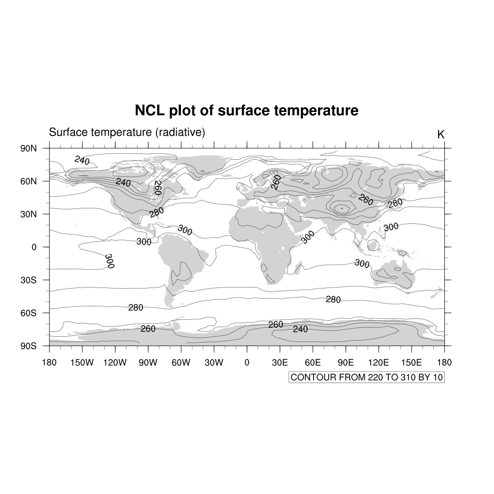

The default type of contours lines are solid black lines. 
To change to a different color or dash pattern, use the cn resources:

~~~
res@cnLineDashPattern = 1 ; use dash pattern 1
res@cnLineColor = "NavyBlue"
~~~
{: .language-bash}

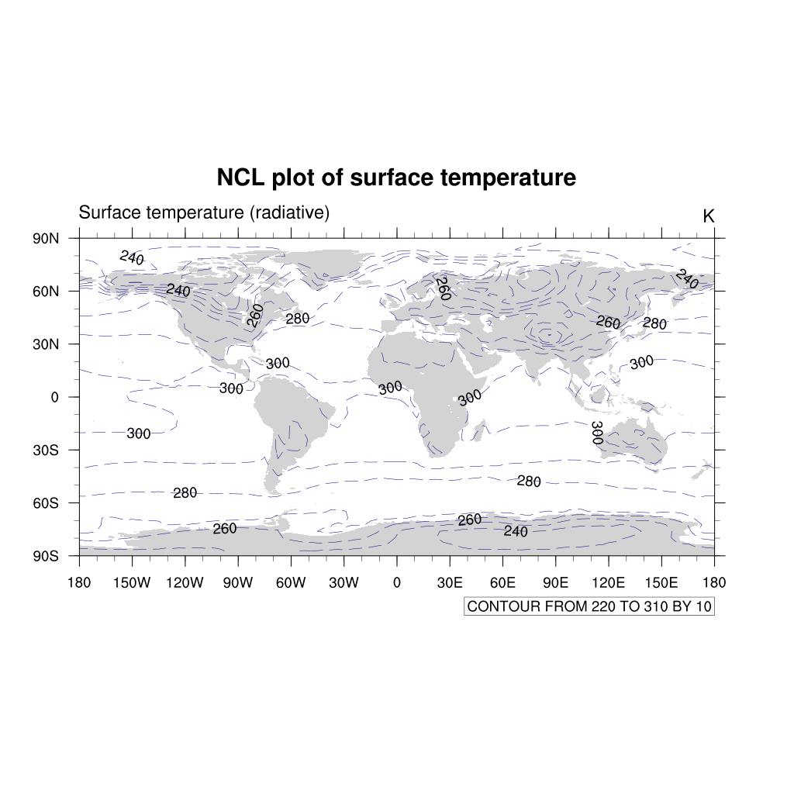

### Filled contour

We can make the very same plot but change the resources to get filled contour:

~~~
f = addfile("f2000.T31T31.control.cam.h0.0008-12-22-00000.nc","r")
TS = f->TS(0,:,:)  ; first time, and all latitudes/longitudes
wks = gsn_open_wks("png","plot surface temperature")
res = True
res@tiMainString = "NCL plot of surface temperature"
res@gsnMaximize = True ; maxmize plot in frame
; add resources properties to get filled contour
res@cnFillOn = True ;-- turn off contour fill
res@cnLinesOn = False ;-- turn off contour lines
res@cnLineLabelsOn = False ;-- turn off line labels
res@cnLevelSelectionMode = "ManualLevels" ;-- set contour levels manually
res@cnMinLevelValF = 250. ;-- minimum contour level
res@cnMaxLevelValF = 310. ;-- maximum contour level
res@cnLevelSpacingF = 1 ;-- contour level spacing
res@lbLabelStride = 4
res@lbBoxMinorExtentF = 0.15 ;-- decrease the height of the
;-- labelbar
res@tiMainFontHeightF = 0.02
plot = gsn_csm_contour_map(wks, TS, res)
~~~
{: .language-bash}

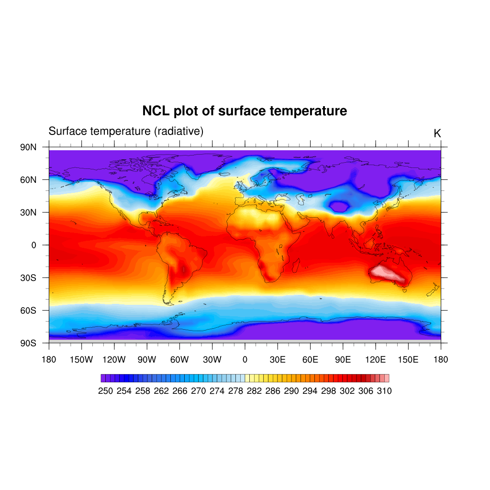

By default, NCL will calculate an equally-spaced array of 10 to 16 nice contour levels based
on the minimum and maximum of your data values. You can change the level spacing that
NCL chooses by setting r`es@cnLevelSpacingF` to the desired spacing. 

To further control the contour levels you can set:
~~~
 res@cnLevelSelectionMode = "ManualLevels"
 res@cnMinLevelValF = 250. ;-- minimum contour level
 res@cnMaxLevelValF = 310. ;-- maximum contour level
 res@cnLevelSpacingF = 1 ;-- contour level spacing
~~~
{: .language-bash}

Or to set an array of unequally-spaced contour levels, set:
~~~
res@cnLevelSelectionMode = "ExplicitLevels"
res@cnLevels = (/250,255,270,275,280,300,310/) 
~~~
{: .language-bash}

By default, the continents are color
filled using light grey; this behaviour can easily be changed by setting the `mpLandFillColor`
resource to the desired color.

~~~
res@mpLandFillColor = "light blue"
~~~
{: .language-bash}

Please note that if you are using filled contour, your continents won't appeared as filled (overwritten by the filled contour).

### Maps

NCL supports many different [map types and projections](https://www.ncl.ucar.edu/Document/Graphics/map_projections.shtml).

In this tutorial, we only give a few examples: 

~~~
; Mercator projection
res@mpProjection = "Mercator"
plot = gsn_csm_contour_map(wks, TS, res)
~~~
{: .language-bash}

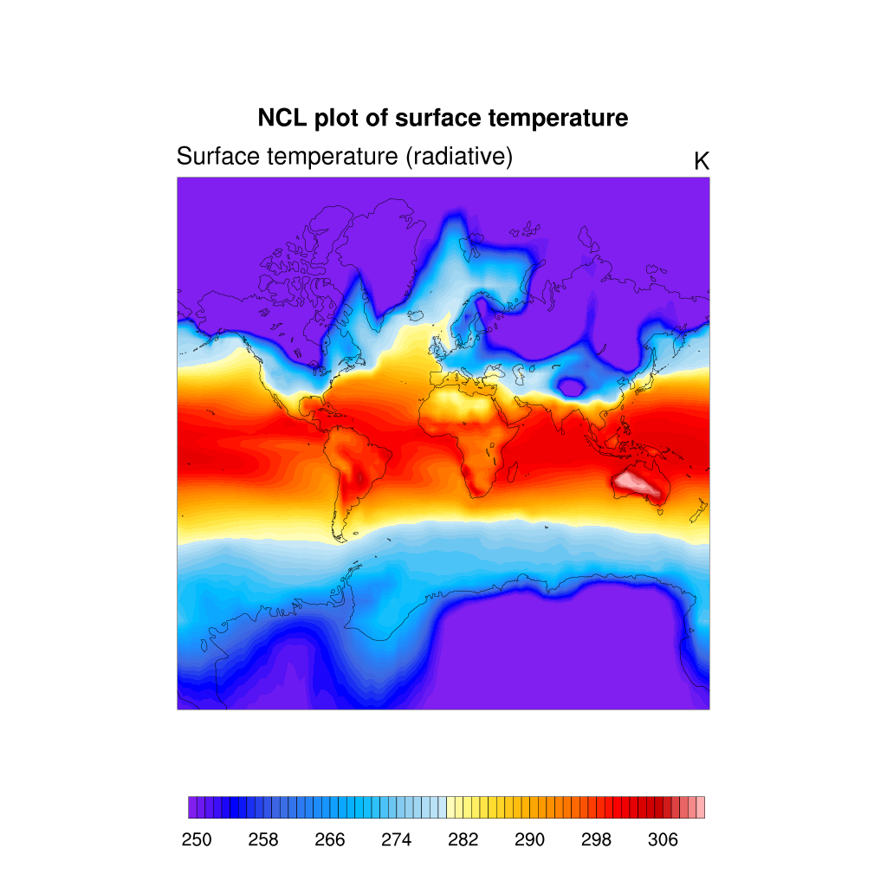

Or using a polar stereographic projection:

~~~
delete(res@mpProjection)  ; needs to be done only if you have previously defined mpProjection to another value
res@gsnPolar= "NH"
plot = gsn_csm_contour_map(wks, TS, res)
~~~
{: .language-bash}

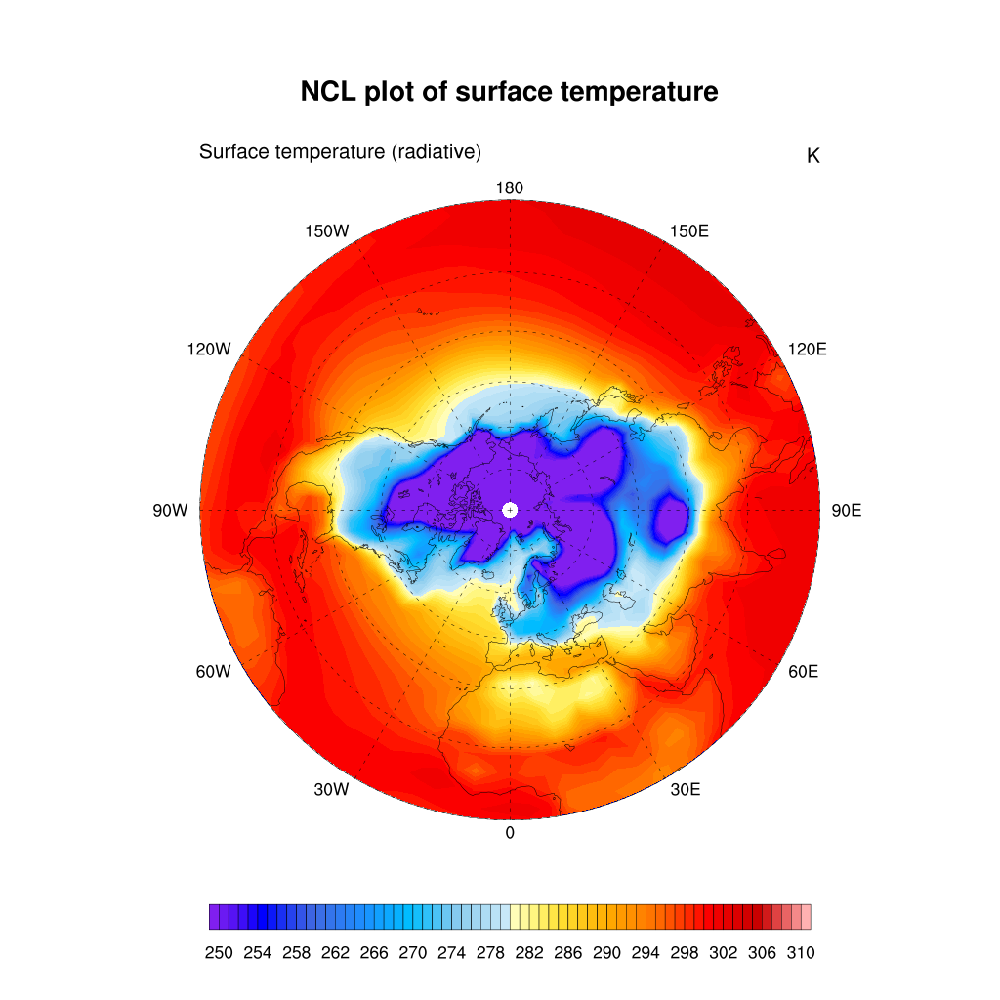

### Regional map

Sometimes, you are interested to zoom over a local area instead of plotting the entire globe. This can be done by setting the extent 
of a map region:
~~~

res@mpProjection = "Mercator"
res@mpMinLonF = -20.0 ;-- min longitude
res@mpMaxLonF = 30.0 ;-- max longitude
res@mpMinLatF = 40.0 ;-- min latitude
res@mpMaxLatF = 90.0 ;-- max latitude
plot = gsn_csm_contour_map(wks, TS, res)
~~~
{: .language-bash}

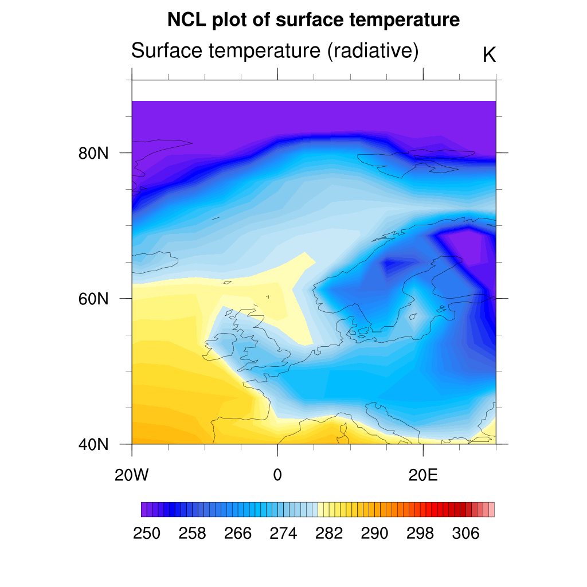

As you can see the map resolution is not very good so you can set a better map resolution:

~~~
res@mpDataBaseVersion = "MediumRes" ;-- better map resolution

plot = gsn_csm_contour_map(wks, TS, res)
~~~
{: .language-bash}

If needed, you can set it to "HighRes" to get the maximum map resolution available.

### Vector plots

For plotting winds, we usually use vector plots:

~~~
U = f->U(0,29,:,:) ;-- first time step
V = f->V(0,29,:,:) ;-- first time step
plot = gsn_csm_vector_map_ce(wks,U,V,False)
~~~
{: .language-bash}

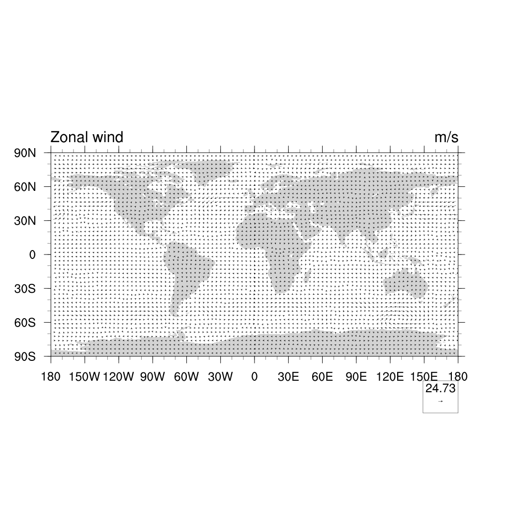

Another nice way of displaying a vector field is `CurlyVector`, which plots short streamline
segments with curved arrows instead of straight arrows. This example also sets some useful
resources to control the length and density of the vectors:

~~~
res:=True   ; redefine res to make sure we do not get anything from previous definition
res@vcMinFracLengthF = 1.0 ;-- length of min vector as
;-- fraction of reference vector
res@vcRefMagnitudeF = 3.0 ;-- make vectors larger
res@vcRefLengthF = 0.045 ;-- ref vec length
res@vcGlyphStyle = "CurlyVector" ;-- turn on curly vectors
res@vcMinDistanceF = 0.01 ;-- thin out vectors
res@tiMainString = "Wind curly vectors"
plot = gsn_csm_vector_map(wks,U,V,res)
~~~
{: .language-bash}

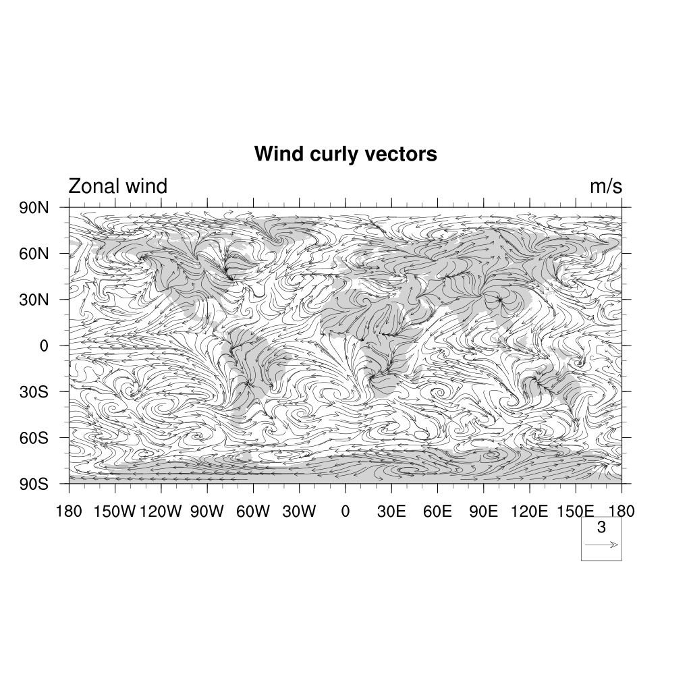

You can also use another variable (here the temperature) to color wind vectors:

~~~

U = f->U(0,29,:,:) ;-- first time step
V = f->V(0,29,:,:) ;-- first time step
T = f->T(0,29,:,:) ;-- first time step

res:=True   ; redefine res to make sure we do not get anything from previous definition
res@vcMinFracLengthF = 1.0 ;-- length of min vector as
;-- fraction of reference vector
res@vcRefMagnitudeF = 3.0 ;-- make vectors larger
res@vcRefLengthF = 0.045 ;-- ref vec length
res@vcGlyphStyle = "CurlyVector" ;-- turn on curly vectors
res@vcMinDistanceF = 0.01 ;-- thin out vectors
res@tiMainString = "Wind curly vectors"
plot = gsn_csm_vector_scalar_map_ce(wks,U,V,T,res)

~~~
{: .language-bash}

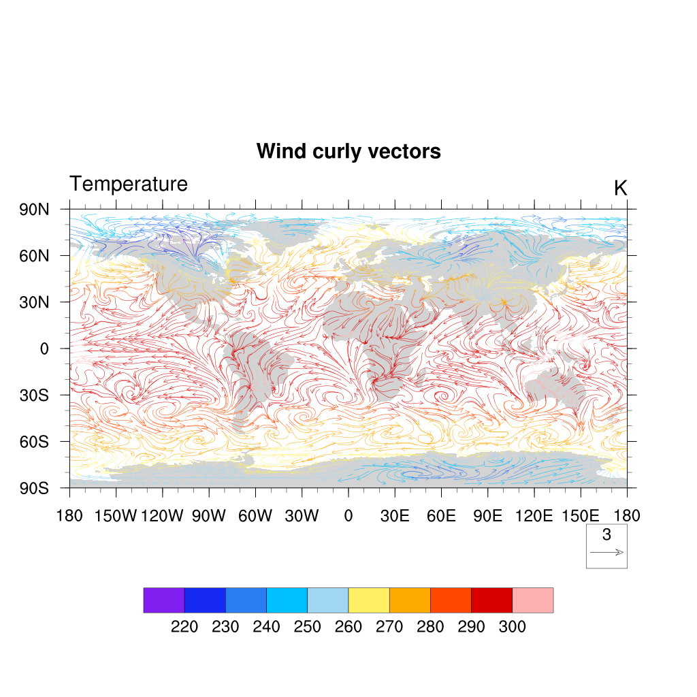

# Slice plots

Multi-dimensional structures in the data can be examined by means of 2D visualization methods if different slices through 
the data are jointly analyzed. 

The example here shows a vertical slice  at latitude 60N, longitudes ranging from 0 to 20E across all
levels in hPa units. We interpolate T on specific pressure levels:

~~~
;---Read in netCDF file
f = addfile("f2000.T31T31.control.cam.h0.0008-12-22-00000.nc","r")
T = f->T(0,:,{60},{0:20}) ;-- first time step, lat=60N, lon=0-20E.
lon_t = f->lon({0:20}) ;-- longitude=0-20E
lev_t = f->lev ;-- all levels
;-- define workstation
wks = gsn_open_wks("png","plot_slices")
gsn_define_colormap(wks,"ncl_default") ;-- set the colormap to be used
;-- set resources
res = True
res@tiMainString = "CESM CAM 5.3: Slice plot at 60N"
res@cnFillOn = True ;-- turn on color fill
res@cnLineLabelsOn = False ;-- turns off contour line labels
res@cnInfoLabelOn = False ;-- turns off contour info label
res@lbOrientation = "vertical" ;-- vertical label bar
res@tiYAxisString = "Temperature on CESM sigma levels"

;-- append units to y-axis label
res@sfXArray = lon_t ;-- uses lon_t as plot x-axis
res@sfYArray = lev_t ;-- uses lev_t as plot y-axis
res@gsnYAxisIrregular2Linear = True ;-- converts irreg depth to linear
res@trYReverse = True ;-- reverses y-axis
;-- generate the plot
plot = gsn_csm_contour(wks,T,res)
~~~
{: .language-bash}

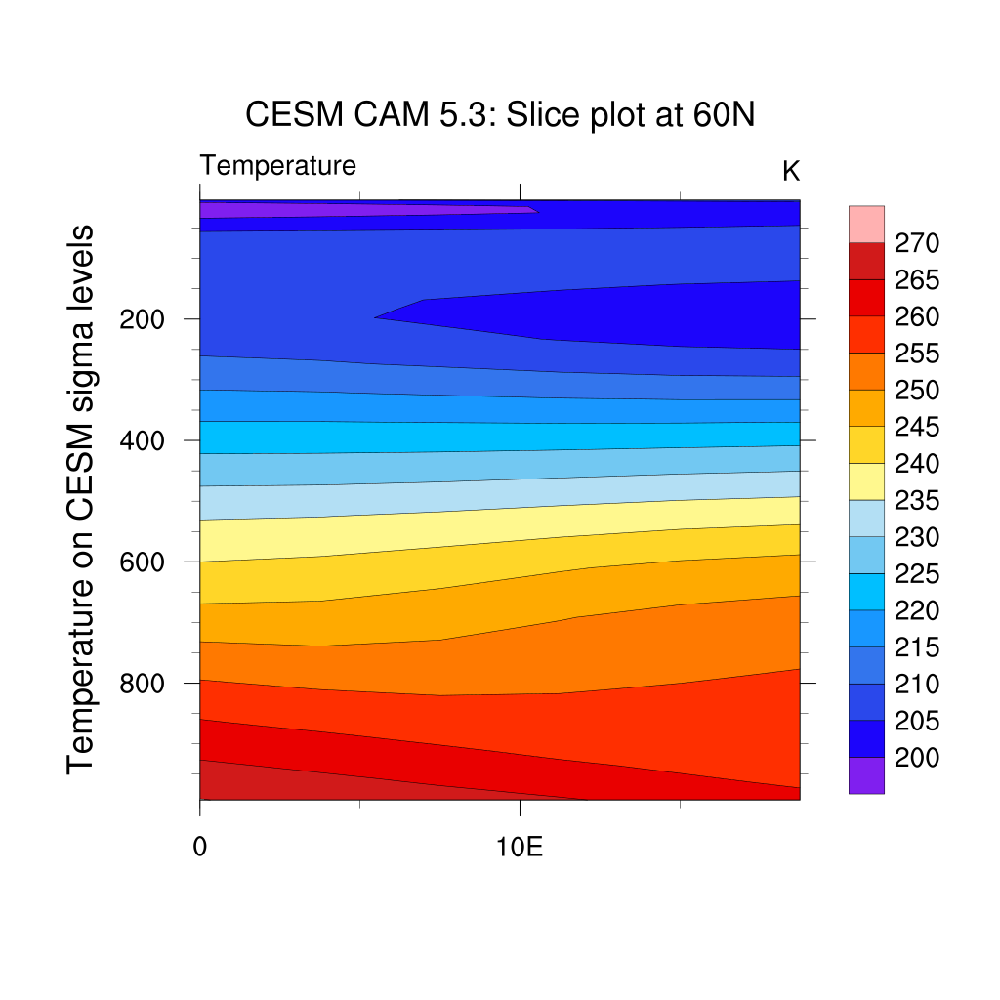

If you first interpolate your fields from hybrid sigma levels to pressure levels:

~~~
f = addfile("f2000.T31T31.control.cam.h0.0008-12-22-00000.nc","r")
T = f->T(0,:,:,:)                           ; get temperature first step only
P0mb = 0.01*f->P0                           ; get reference pressure
hyam = f->hyam                              ; get a coefficiants
hybm = f->hybm                              ; get b coefficiants
PS   = f->PS(0,:,:)                         ; get pressure
PHIS = f->PHIS(0,:,:)                       ; get surface geopotential

; vector containing the new pressure levels 
pnew = (/ 850.0,700.0,500.0,300.0,200.0 /)

nlev = dimsizes(hyam)

tbot = T(nlev-1,:,:) 
T_p =vinth2p_ecmwf(T,hyam,hybm,pnew, \
	           PS,1,P0mb,1,      \
                   True,1,tbot,PHIS)

T_psection = T_p(:,{60},{0:20}) ;-- first time step, lat=60N, lon=0-20E.
lon_t = f->lon({0:20}) ;-- longitude=0-20E
lev_t = f->lev ;-- all levels
;-- define workstation
wks = gsn_open_wks("png","plot_slices")
gsn_define_colormap(wks,"ncl_default") ;-- set the colormap to be used
;-- set resources
res = True
res@tiMainString = "CESM CAM 5.3: Slice plot at 60N"
res@cnFillOn = True ;-- turn on color fill
res@cnLineLabelsOn = False ;-- turns off contour line labels
res@cnInfoLabelOn = False ;-- turns off contour info label
res@lbOrientation = "vertical" ;-- vertical label bar
res@tiYAxisString = "Temperature on pressure level [hPa]"

;-- append units to y-axis label
res@sfXArray = lon_t ;-- uses lon_t as plot x-axis
res@sfYArray = pnew ;-- uses pnew as plot y-axis
res@gsnYAxisIrregular2Linear = True ;-- converts irreg depth to linear
res@trYReverse = True ;-- reverses y-axis
;-- generate the plot
plot = gsn_csm_contour(wks,T_psection,res)

~~~
{: .language-bash}

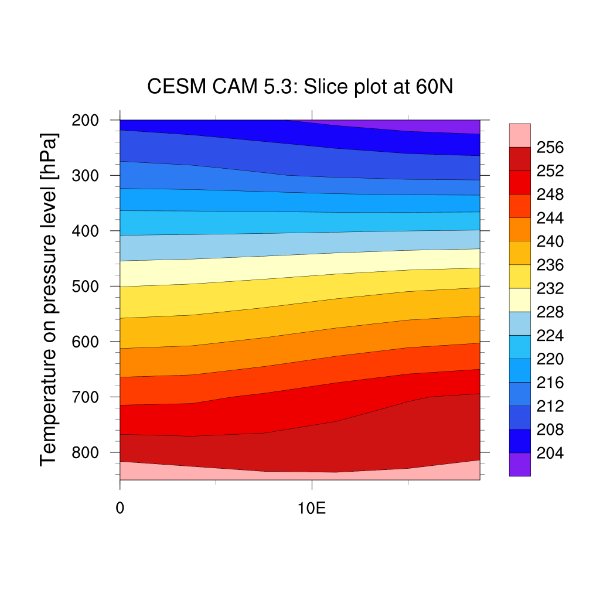

# Plot overlay

One great feature of NCL is its support for overlaying graphical elements on top of other
elements. 

Let's take one of our previous example where we plotted a filled contour of temperatures. We can overlay it with for instance wind curly vectors:

~~~
f = addfile("f2000.T31T31.control.cam.h0.0008-12-22-00000.nc","r")
TS = f->TS(0,:,:)  ; first time, and all latitudes/longitudes
wks = gsn_open_wks("png","plot surface temperature with wind vectors")

; First plot with surface temperature (use a new variable cres for storing resources
cres = True
cres@tiMainString = "NCL plot of surface temperature"
cres@gsnMaximize = True ; maxmize plot in frame
; add resources properties to get filled contour
cres@cnFillOn = True ;-- turn off contour fill
cres@cnLinesOn = False ;-- turn off contour lines
cres@cnLineLabelsOn = False ;-- turn off line labels
cres@cnLevelSelectionMode = "ManualLevels" ;-- set contour levels manually
cres@cnMinLevelValF = 250. ;-- minimum contour level
cres@cnMaxLevelValF = 310. ;-- maximum contour level
cres@cnLevelSpacingF = 1 ;-- contour level spacing
cres@lbLabelStride = 4
cres@lbBoxMinorExtentF = 0.15 ;-- decrease the height of the
;-- labelbar
cres@tiMainFontHeightF = 0.02
; create a plot called cplot
cplot = gsn_csm_contour_map(wks, TS, cres)

; Create a second plot for wind curly vectors

U = f->U(0,29,:,:) ;-- first time step
V = f->V(0,29,:,:) ;-- first time step

wres:=True   ; redefine res to make sure we do not get anything from previous definition
wres@vcMinFracLengthF = 1.0 ;-- length of min vector as
;-- fraction of reference vector
wres@vcRefMagnitudeF = 3.0 ;-- make vectors larger
wres@vcRefLengthF = 0.045 ;-- ref vec length
wres@vcGlyphStyle = "CurlyVector" ;-- turn on curly vectors
wres@vcMinDistanceF = 0.01 ;-- thin out vectors
wres@tiMainString = "Wind curly vectors"

; This time we don't use _map as we want to overlay on an existing map
wplot = gsn_csm_vector(wks,U,V,wres)

; create the combined plot
overlay(cplot,wplot)
draw(cplot) ; cplot now contains both itself, and vplot
frame(wks)
~~~
{: .language-bash}

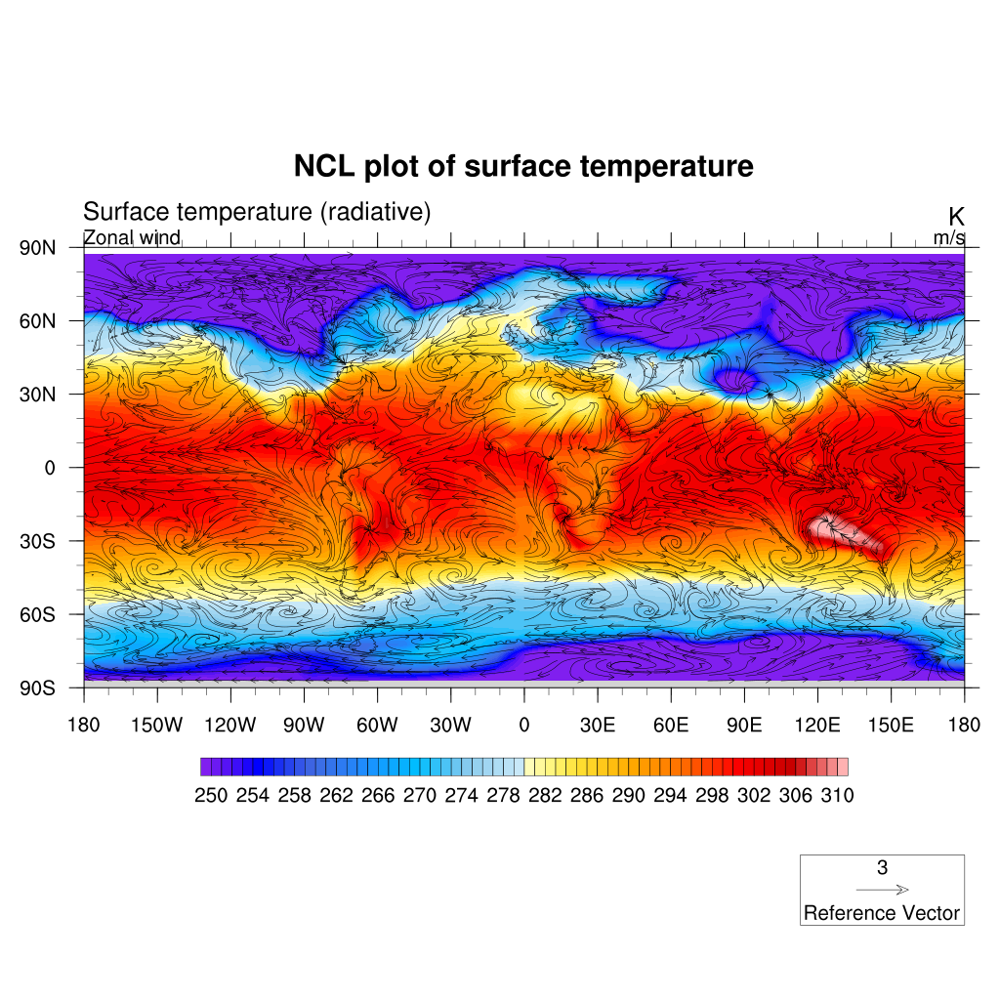

The powerful “overlay” procedure overlays one
plot on a base plot, such that the base plot now contains both plots. NCL examines the data
space of both plots to correctly transform the overlay plot to the base plot. If both plots you
want to overlay are maps, then only the base plot can be a map, and the overlay plot must
just be a contour, vector, or other type of plot.

# Organize your plots

NCL allows the drawing of multiple plots on a single page (frame) using the procedure
gsn_panel. The plots will be drawn from the left to right side of the page and from the top
down to the bottom. A common labelbar or title for all plots can be included.

~~~
f = addfile("f2000.T31T31.control.cam.h0.0008-12-22-00000.nc","r")
TS = f->TS(0,:,:)  ; first time, and all latitudes/longitudes
wks = gsn_open_wks("png","plot surface temperature with wind vectors")

;-- create plot array (2 plots)
plot = new(2,graphic)

; First plot with surface temperature (use a new variable cres for storing resources
cres = True
cres@tiMainString = "NCL plot of surface temperature"
cres@gsnMaximize = True ; maxmize plot in frame
; add resources properties to get filled contour
cres@cnFillOn = True ;-- turn off contour fill
cres@cnLinesOn = False ;-- turn off contour lines
cres@cnLineLabelsOn = False ;-- turn off line labels
cres@cnLevelSelectionMode = "ManualLevels" ;-- set contour levels manually
cres@cnMinLevelValF = 250. ;-- minimum contour level
cres@cnMaxLevelValF = 310. ;-- maximum contour level
cres@cnLevelSpacingF = 1 ;-- contour level spacing
cres@lbLabelStride = 4
cres@lbBoxMinorExtentF = 0.15 ;-- decrease the height of the
;-- labelbar
cres@tiMainFontHeightF = 0.02
; create the first plot
plot(0) = gsn_csm_contour_map(wks, TS, cres)

; Create a second plot for wind curly vectors

U = f->U(0,29,:,:) ;-- first time step
V = f->V(0,29,:,:) ;-- first time step

wres:=True   ; redefine res to make sure we do not get anything from previous definition
wres@vcMinFracLengthF = 1.0 ;-- length of min vector as
;-- fraction of reference vector
wres@vcRefMagnitudeF = 3.0 ;-- make vectors larger
wres@vcRefLengthF = 0.045 ;-- ref vec length
wres@vcGlyphStyle = "CurlyVector" ;-- turn on curly vectors
wres@vcMinDistanceF = 0.01 ;-- thin out vectors
wres@tiMainString = "Wind curly vectors"
; Create the second plot
plot(1) = gsn_csm_vector_map(wks,U,V,wres)

; 
;-- create panel plot 2 rows and one column
gsn_panel(wks,plot,(/2,1/),False)
~~~
{: .language-bash}

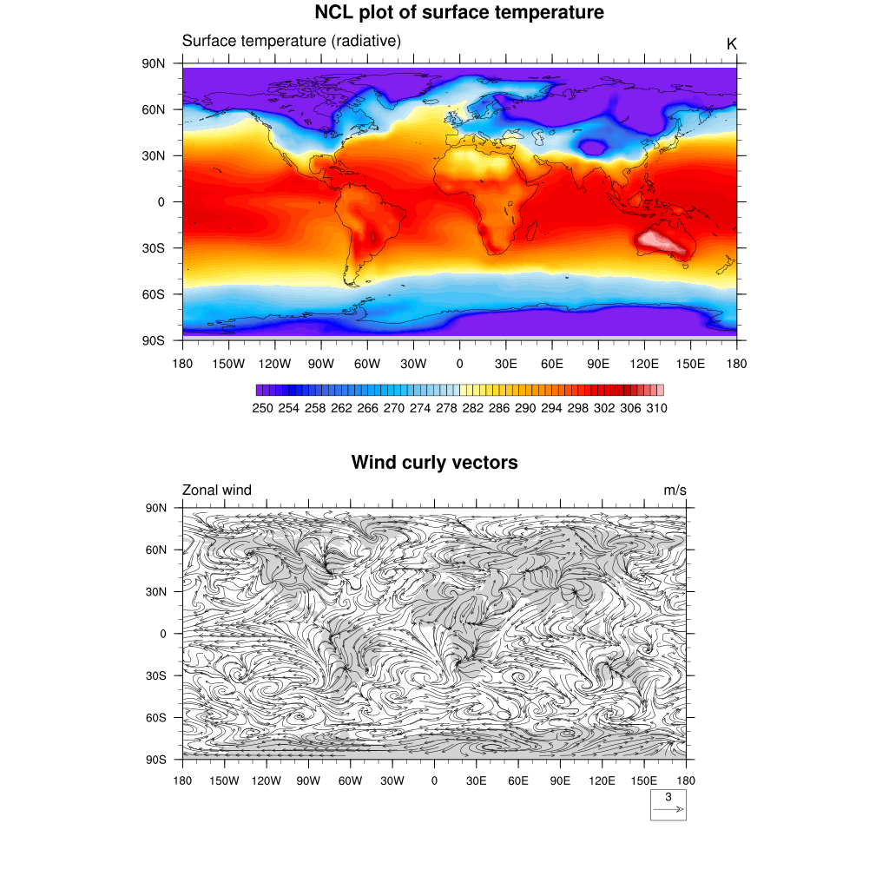

To get an horizontal panel i.e. 1 row and 2 colums:

~~~
;-- create panel plot 1 row and 2 columns
gsn_panel(wks,plot,(/1,2/),False)
~~~
{: .language-bash}

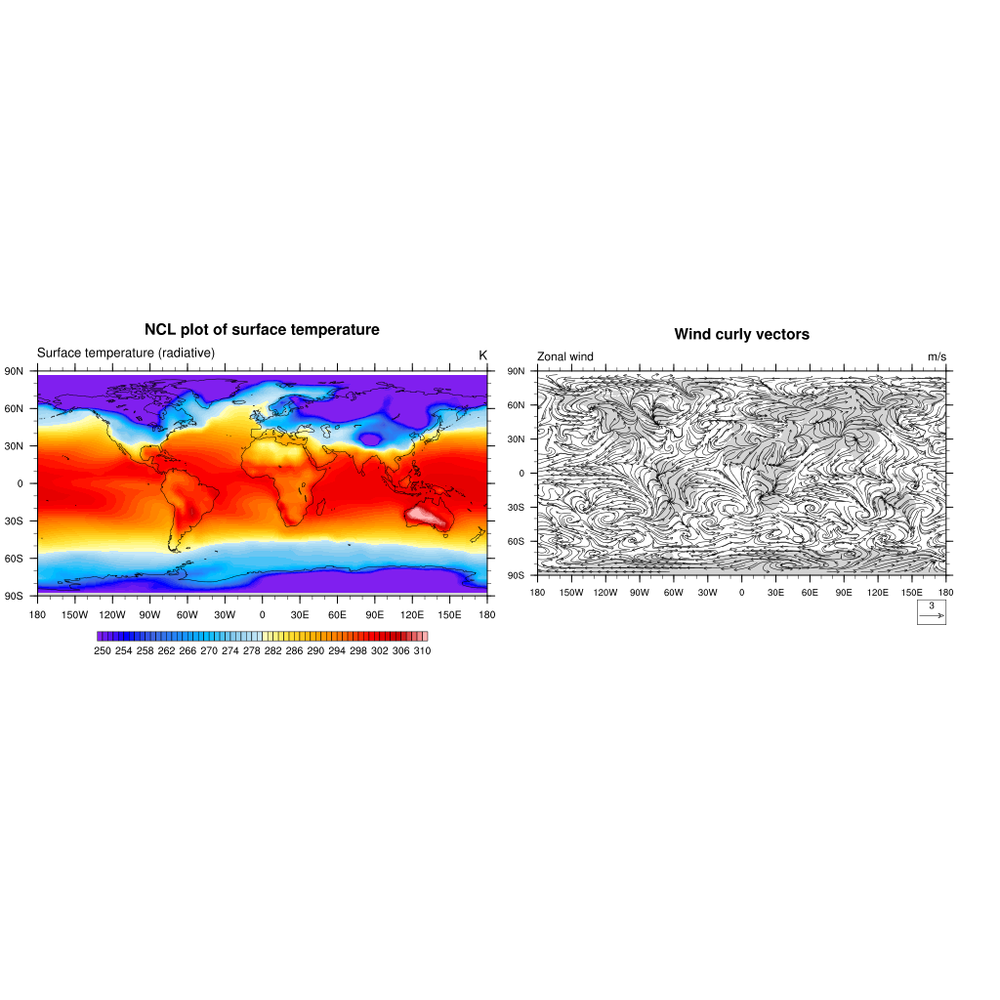